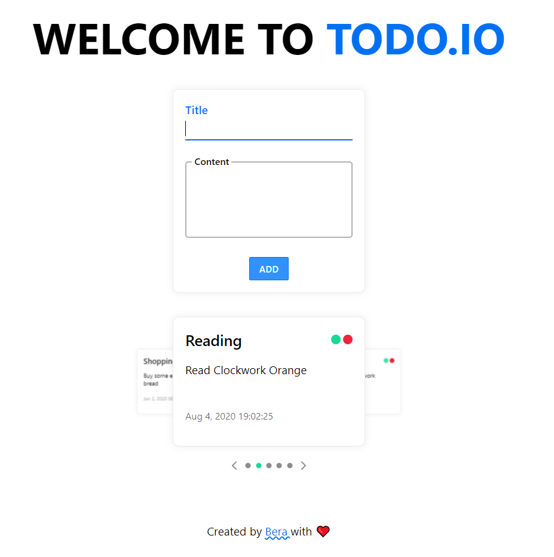

<div align="center">
	<br>
        
	<br>
</div>

# [Todo.io](http://github.com/MuhammedBeraKoc)<br>  [](https://www.gnu.org/licenses/gpl-3.0) [](https://shields.io/)  [](https://GitHub.com/Naereen/StrapDown.js/graphs/commit-activity)

Designed and implemented using delicate methods and created an organised file system. Created unit tests using [Jest🃏](https://jestjs.io/) and [supertest](https://www.npmjs.com/package/supertest) for API mockup. Current functionalities are adding, finishing and deleting todo cards.
Added data validation for backend using [@hapi/joi](https://hapi.dev/module/joi/). Used [Express.js](https://expressjs.com/) for backend and REST API. The frontend solely depends on [ReactJS](https://reactjs.org/).

## Installation 📦
To install the app you have to install [git](https://git-scm.com/downloads).

``` bash
git clone https://github.com/MuhammedBeraKoc/todo-app.git
```

## Running 🌌

### Windows 🖥️

Go to your project root (.../todo-app). Open two terminals there. In the first terminal, write the command below to start the server:
``` bat
cd .\server
npm start
```
Then in the second terminal write commands below:
``` bat
cd ..\client
npm start
```



Voila! Now you should see application in your browser screen like above.

### Unix 🖥️

Basically same steps but commands change a little like below:
``` bash
cd ./server
npm start
```
``` bash
cd ../client
npm start
```

## Testing 🧪
Open a new terminal in the project root.
For windows:
``` bat
cd .\server && npm test
```
For Unix:
``` bash
cd ./server && npm test
```
There are three predefined scripts for testing:<br>
1. npm test: Runs the default testing. Runs test suites for one time with basic info.
2. npm run test:coverage: Runs unit tests for one time but with coverage. Coverage shows the function stack in a table and shows the consumed time for each one.
3. npm run test\:watch: Runs unit tests when there is a difference in test suites. Also has miscallenous options to run.

## Contributing 🙋‍♂️
Pull requests are welcome. For major changes, please open an issue first to discuss what you would like to change.

Please make sure to update tests as appropriate.

## License 📃
This project has licensed with [MIT](https://github.com/MuhammedBeraKoc/todo-app/blob/master/LICENSE).